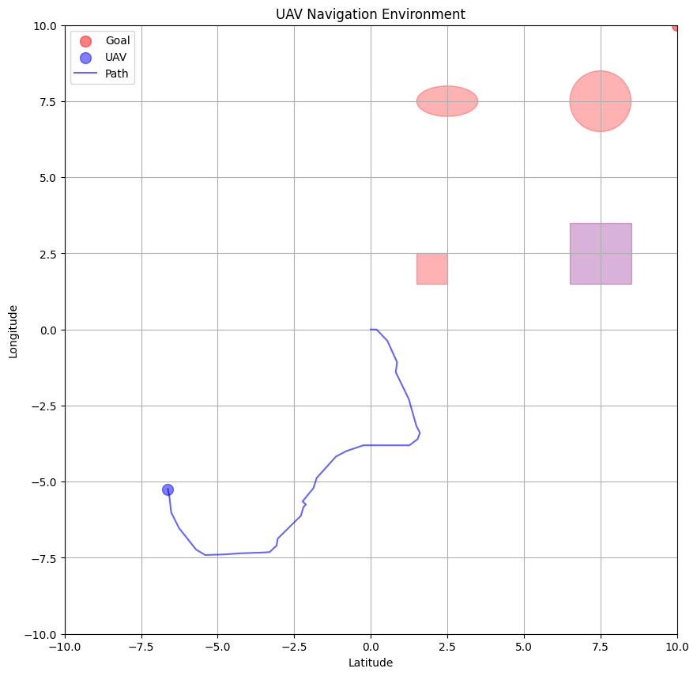

# AI-For-Route-Planning-Using-Deep-Reinforcement-Learning
 MSc-Project
## Project Overview
This project aims to develop an AI system using Deep Reinforcement Learning (DRL) to optimize the path planning of UAVs (Unmanned Aerial Vehicles). It utilizes the Proximal Policy Optimization (PPO) and Double Deep Q-Network (DDQN) algorithms to train UAVs in a simulated environment, enabling them to recognize activities on the ground, avoid obstacles, and adapt their course in response to environmental factors.

## Repository Contents
- `2-UAV-DDQN.ipynb`: Notebook implementing the DDQN algorithm with two UAV's, experimented and can be used with high computational power.
- `PPO&DDQN(final).ipynb`: Notebook for the final combined model using PPO and DDQN.
- `Initial-PPO-Model.ipynb`: Initial modeling using the PPO algorithm.
- `PPO-HyperparameterOptimization-Tuning.ipynb`: Hyperparameter tuning for the PPO model.
- `Environment Initial.png`, `DDQN.png`: Visualization of the initial environment setup and DDQN path results.
- `PPO.gif`: Animated path visualization of the UAV using PPO.

## Getting Started
To run this project locally, follow these steps to set up your environment.

### Prerequisites
Ensure you have Python 3.x installed along with pip. This project also requires the following major libraries:
- gym
- stable-baselines3
- tensorflow or pytorch
- matplotlib
- numpy

- ### Installation
Clone the repository to your local machine:
```bash
git clone https://github.com/AmmarKafeel47/AI-For-Route-Planning-Using-Deep-Reinforcement-Learning.git
cd AI-For-Route-Planning-Using-Deep-Reinforcement-Learning 
```

Install the required Python libraries:
```bash
pip install -r requirements.txt
```
**Usage**

Navigate to the notebook you want to run, for example:

```bash
jupyter notebook 2-UAV-DDQN.ipynb
```
## Visualizations

The project includes several visualizations to illustrate the effectiveness of the navigation models:


Initial setup of the UAV navigation environment showing obstacles and targets.


Visualization of the UAV path planning using the DDQN algorithm.


Animated GIF showing the UAV navigation using the PPO model.

## Model Configuration and Evaluation
Detailed parameters for the models and evaluation metrics are provided within each notebook. These parameters include learning rates, the architecture of neural networks, and the specific configurations of the simulation environment used for training the UAVs.

## Contributing
Feel free to fork this repository or submit pull requests. For major changes, please open an issue first to discuss what you would like to change.

## Acknowledgments
Inspiration from the need for advanced UAV navigation systems.
Thanks to the contributors of the used open-source libraries and my professors.

_This README file serves as a comprehensive guide for anyone who wants to understand or use our project. It includes basic setup instructions, a description of the contents, usage examples, and a visualization section that refers to the images provided. Adjust the paths and descriptions as needed to match your repository structure and specific details. And all of the Notebooks have markdown and comments for better understandings._
